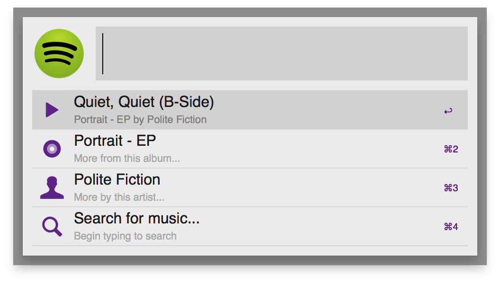
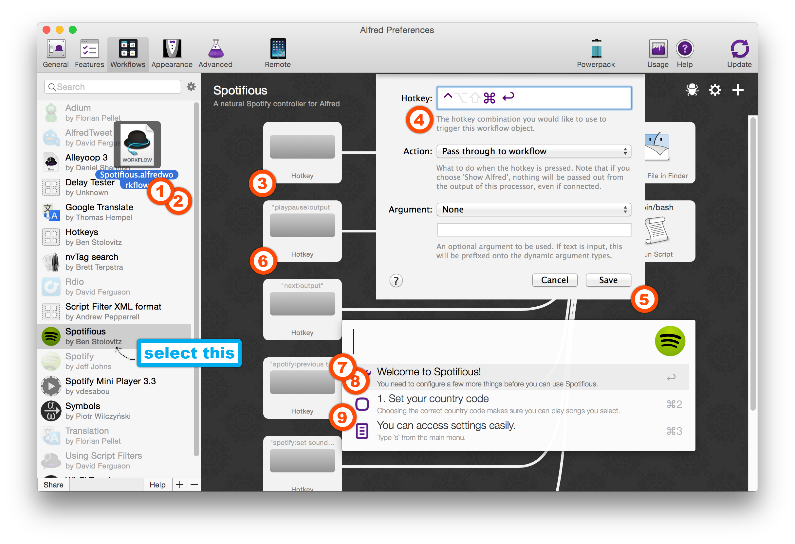
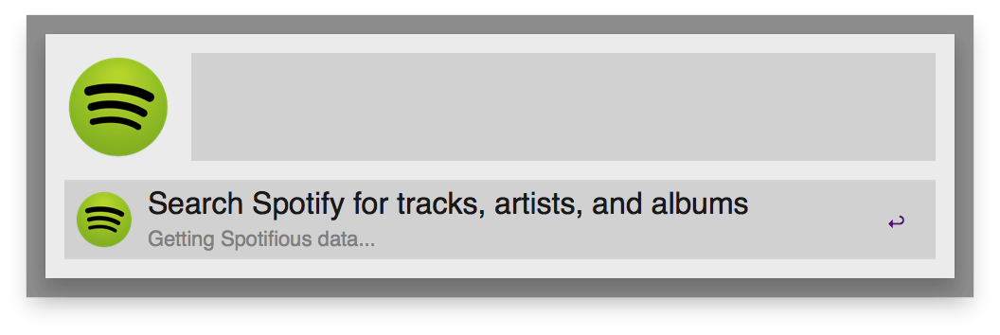
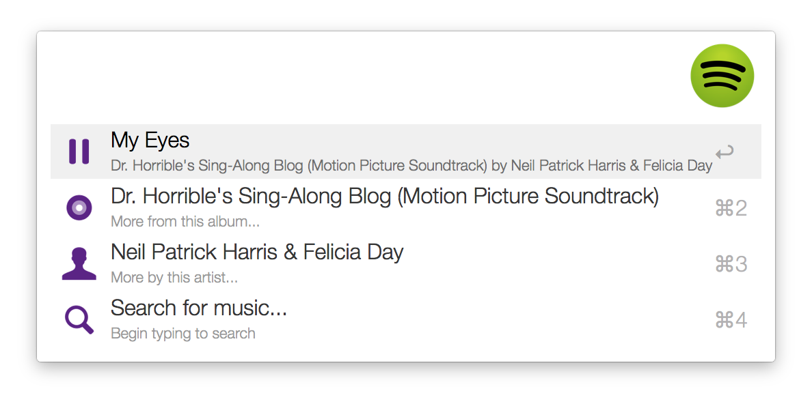
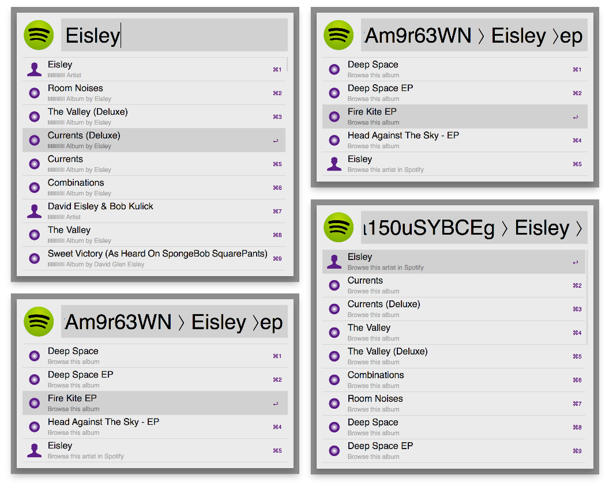

# Spotifious #
## a natural Spotify controller for Alfred ##

So, you've heard of **Spotifious**, eh? *A natural Spotify controller for
Alfred*? Searches Spotify, controls your music, generally rocks?

It's built off a lot of other people's work—
[PHPFunk](https://github.com/phpfunk/alfred-spotify-controls) and
[David Ferguson](http://jdfwarrior.tumblr.com/) especially— and tries to match
the functionality of Alfred's integrated iTunes player. It's not perfect, but it does the job. And I think it's pretty cool.

## Features ##

A quick rundown of its coolness:

### A controller, not a workflow ###

Spotifious just *feels* fun to use, like a real plugin for Alfred, not a workflow. It
can do in-depth, album-scouring searches and gives you useful information even if something goes wrong.

Not unlike the iTunes Mini Player.

### Alfred-like ###

Spotifious is also especially Alfred-like. Just start typing to scour Spotify's servers for music. Browse through artists and albums like nobody's business  and drill down through Queen's huge anthologies with a snappy context-based search.

### Smart ###

Spotifious uses Packal to make sure you always have the latest version. It gives you a heads-up about what's going on with Spotify *the moment you
start it*. And don't worry about errors— we'll handle those.

## Download & Install ##

Latest version: [v0.9.4](https://github.com/citelao/Spotify-for-Alfred/archive/master.zip) | Latest dev build: [v0.9.4](https://github.com/citelao/Spotify-for-Alfred/archive/dev.zip)

1. [Download](https://github.com/citelao/Spotify-for-Alfred/archive/master.zip)
this repository.
2. Open `Spotifious.alfredworkflow` by double-clicking it or dragging it into
Alfred.
3. Double-click the thingy marked `Hotkey`.
4. Click the textfield labeled `Hotkey` and press `^⌘⏎`.
5. Click `Save` to store the binding.
6. Continue on with your merry day— but now with Spotifious.

## How to Use ##

So let's assume you've downloaded and installed the workflow. Now what?

1. Press `^⌘⏎`.

Good! You should briefly see a loading entry, then the main menu:

You can action the song title (press `⏎`) to play or pause the song, action 
the album or artist to search for that album or artist, or just start typing to 
search for cool music.

Once you've searched for something, you can continue to browse albums and arists through Spotifious. Actioning an artist will bring up a list of their albums, and actioning an album will bring up the track list.

If you're looking through a really long album or a particularly prodigious artist, you can also narrow your search by typing a little more— Spotifious will search for results within the album or artist.

**Note:** You can always leave a menu and go back just by pressing `⌫`.

## Acknowledgements ##

A lot of people helped out on this:

- **vdesabou** and I trade ideas a ton
- **PHPfunk** and his PHP Alfred workflow inspired much of `OhAlfred`
- **David Ferguson** helped with some iffy Alfred glitches
- a slightly modified version of [Entypo](http://www.entypo.com/) icon font face for icons.
- and many other people mentioned in the code.

Thanks to everyone who helped, and thanks to everyone who uses my work!
Oh, and thanks for reading this whole README. I hope you enjoy Spotifious!

## TODO ##

- Allow `⎇`, `^`, and `⌘` to function as modifiers (Open in Spotify, other things?).
- More in-depth Spotify control (radio, queuing, playlists)
- Make main menu links go directly to menus.

## Changelog ##

See `CHANGELOG.md` for more detailed information.

- v0.9.4: actually implemented the aforementioned changes.
- v0.9.3: more compatibility changes for PHP v5.3
- v0.9.2: Compatibility changes for PHP v5.3
- v0.9.1: Fixed "no track" bug.
- v0.9:   Added error reporting and context-based searching; restructrued app.
- v0.8:   Added new icons; set them as default
- v0.7:   General clean-up; added artist- and album-specific menus
- v0.6:   Added Alleyoop support
- v0.5:   Added a menu system
- v0.1:   Inital search system

This code is MIT Licensed.
