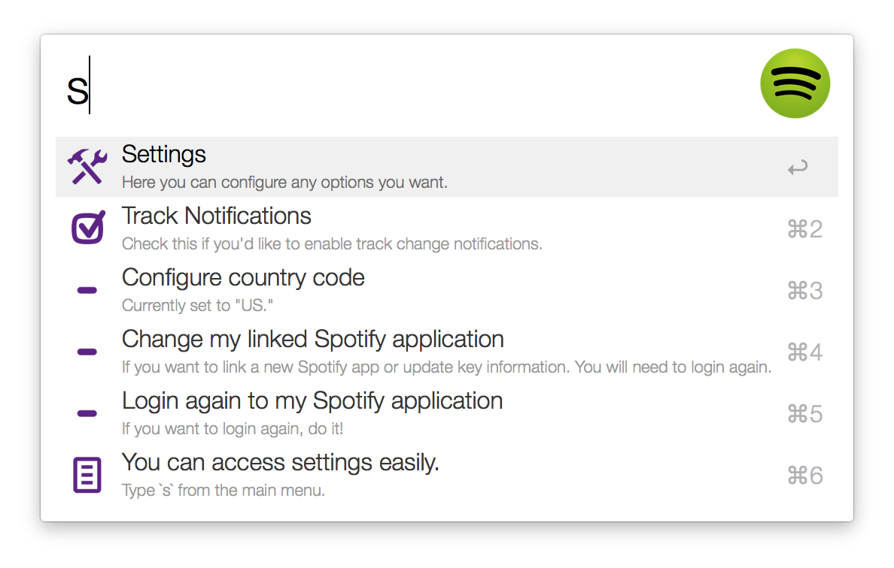

# Spotifious #
## a natural Spotify controller for Alfred ##

So, you've heard of **Spotifious**, eh? *A natural Spotify controller for
Alfred*? Searches Spotify, controls your music, generally rocks?

It's built off a lot of other people's work—
[PHPFunk](https://github.com/phpfunk/alfred-spotify-controls) and
[David Ferguson](http://jdfwarrior.tumblr.com/) especially— and tries to match
the functionality of Alfred's integrated iTunes player. It's not perfect, but it does the job. And I think it's pretty cool.

## Features ##

A quick rundown of its coolness:

### A controller, not a workflow ###

Spotifious just *feels* fun to use, like a real plugin for Alfred, not a workflow. It
can do in-depth, album-scouring searches and gives you useful information even if something goes wrong. Filter by artist or album, search for specific tracks or just plain see what's playing. It's all there.

Not unlike the iTunes Mini Player.

### Alfred-like ###

Spotifious is also especially Alfred-like. Just start typing to scour Spotify's servers for music. Browse through artists and albums like nobody's business and drill down through Queen's huge anthologies with a snappy context-based search and filtering. Your frequent searches rise to the top, and your controls pop up with the letter `c`.

### Smart ###

Spotifious uses Packal to make sure you always have the latest version. It gives you a heads-up about what's going on with Spotify *the moment you start it*. And don't worry about errors— we'll handle those. All you have to do is choose how you want to pop it up on screen.

## Download & Install ##

Latest version: [v0.13.1](https://github.com/citelao/Spotify-for-Alfred/archive/master.zip) | Latest dev build: [v0.13.1](https://github.com/citelao/Spotify-for-Alfred/archive/dev.zip)

An in-depth [installation guide](http://ben.stolovitz.com/Spotify-for-Alfred/download/) is available on the Spotifious website.

1. [Download](https://github.com/citelao/Spotify-for-Alfred/archive/master.zip)
this repository.
2. Open `Spotifious.alfredworkflow` by double-clicking it or dragging it into
Alfred.
3. Double-click the first thingy marked `Hotkey`.
4. Click the textfield labeled `Hotkey` and press `^⌘⏎`.
5. Click `Save` to store the binding.
6. Bind the other hotkeys as you wish. Their actions are visible in the `Text` field, under `Argument`.
7. Pop up Spotifious with the key command you set— I would have `^⌘⏎`.
8. Follow the instructions on the set-up menu.
	1. You'll be asked to choose your country (for better search results— you can opt out).
	2. You'll create a Spotify application (or not, you can opt out).
	3. You'll link the new app to Spotifious.
10. Continue on with your merry day— but now with Spotifious.

## How to Use ##

So let's assume you've downloaded and installed the workflow. Now what?

1. Press `^⌘⏎`.

Good! You should briefly see a loading entry, then the main menu:

You can action the song title (press `⏎`) to play or pause the song, action 
the album or artist to search for that album or artist, or just start typing to 
search for cool music.

Once you've searched for something, you can continue to browse albums and arists through Spotifious. Actioning an artist will bring up a list of their albums, and actioning an album will bring up the track list.

If you're looking through a really long album or a particularly prodigious artist, you can also narrow your search by typing a little more— Spotifious will search for results within the album or artist.

**Note:** You can always leave a menu and go back just by pressing `⌫`.

You can access a small controls menu by typing `c` at the main menu.

You can change your settings by typing `s` at the main menu.

## Acknowledgements ##

A lot of people helped out on this:

- **vdesabou** and I trade ideas a ton
- **PHPfunk** and his PHP Alfred workflow inspired much of `OhAlfred`
- **David Ferguson** helped with some iffy Alfred glitches
- **jwilsson**'s [Spotify PHP web API](http://jwilsson.github.io/spotify-web-api-php/).
- a slightly modified version of [Entypo](http://www.entypo.com/) icon font face for icons.
- and many other people mentioned in the code.

Thanks to everyone who helped, and thanks to everyone who uses my work!
Oh, and thanks for reading this whole README. I hope you enjoy Spotifious!

## TODO ##

- Allow `⎇`, `^`, and `⌘` to function as modifiers (Open in Spotify, other things?).
- More in-depth Spotify control (radio, queuing, playlists)
- Make main menu links go directly to menus.

## Changelog ##

This project uses pseudo-SemVer. It will use SemVer when we hit v1.0.0.

See `CHANGELOG.md`.

## License ##

This code is licensed as written in the LICENSE.md file.